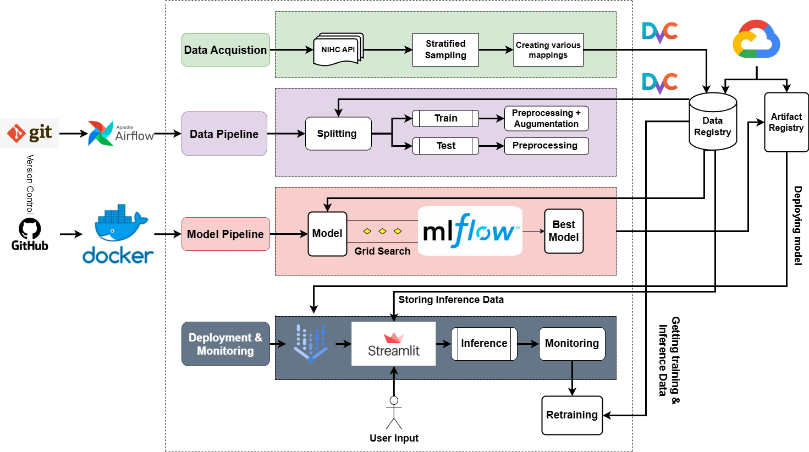
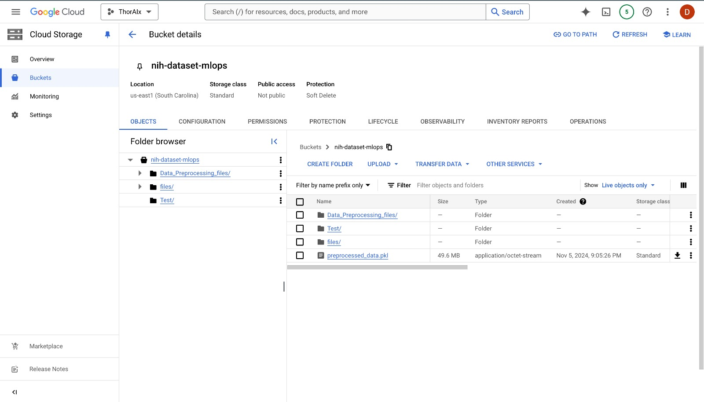
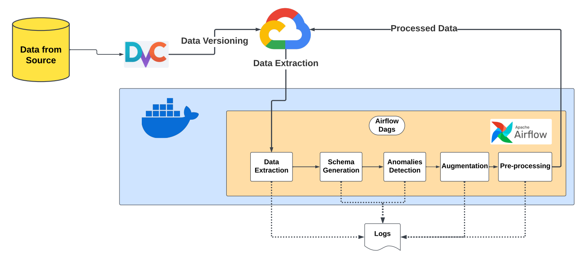

# Multiclass Thoracic Disease Classification

This project is designed to develop, deploy, and maintain a machine learning model for multiclass disease classification of chest X-rays. It utilizes a Machine Learning Operations (MLOps) framework to ensure seamless development, deployment, and continuous monitoring of the model. The project follows best practices for reproducibility, modularity, and scalability.

# Table of Contents

- [Multiclass Thoracic Disease Classification](#multiclass-thoracic-disease-classification)
  - [Introduction](#introduction)
  - [Dataset Information](#dataset-information)
    - [DataCard](#datacard)
    - [Disease Categories - Labels](#disease-categories---labels)
  - [Project Workflow](#project-workflow)
  - [Git Repo and Project Structure](#git-repo-and-project-structure)
  - [Installation](#installation)
    - [Pre-requisites](#pre-requisites)
    - [User Installation](#user-installation)
  - [DVC (Data Version Control)](#dvc-data-version-control)
  - [Google Cloud Computing](#google-cloud-computing)
  - [Integration of Docker and Airflow](#integration-of-docker-and-airflow)
  - [Data Extraction](#data-extraction)
  - [Schema and Statistics Generation](#schema-and-statistics-generation)
  - [Anomalies Detection](#anomalies-detection)
  - [Augmentation and Pre-processing](#augmentation-and-pre-processing)
  - [Data Pipeline](#data-pipeline)
  - [Airflow Dags](#airflow-dags)
  - [Optimized Pipeline](#optimized-pipeline)
  - [Data Versioning](#data-versioning)
  - [Model pipeline](#model-pipeline)
  - [CI/CD](#CI/CD)
  - [Bias Detection](#bias-detection)
  - [Contributors](#contributors)

## Introduction

Thoracic diseases, such as pneumonia, emphysema, and cardiomegaly, are significant health concerns globally, affecting millions of people each year. In the United States alone, respiratory diseases contribute to a high percentage of hospitalizations and healthcare costs. Accurate diagnosis of these conditions is crucial for effective treatment, yet traditional diagnostic methods rely heavily on manual analysis of medical images like chest X-rays. This process can be time-consuming and subject to human error, especially in areas with limited access to trained radiologists.

Motivated by these challenges, we chose this topic for our MLOps project. By leveraging the principles of MLOps, we have developed an end-to-end machine learning pipeline for automated thoracic disease classification using chest X-rays. Our solution is built to enhance the accuracy and efficiency of non-invasive diagnostic methods, aiming to assist healthcare providers with reliable, timely, and scalable diagnostic support.

By automating the process of classifying multiple thoracic diseases from chest X-ray images, this approach has the potential to alleviate the burden on healthcare professionals, reduce diagnostic errors, and provide faster results, especially in underserved areas where radiologists may not always be available.

This project integrates best practices in MLOps to ensure that our model is not only accurate but also easy to maintain and deploy, making it suitable for real-world clinical use.

## Dataset Information

The project utilizes the NIH ChestX-ray14 dataset, one of the largest publicly available chest X-ray image datasets for research purposes. The dataset is provided by the National Institutes of Health (NIH) Clinical Center and consists of 112,120 frontal-view chest X-ray images from 30,805 unique patients. The dataset is annotated with labels for 14 different thoracic disease categories, including:

### DataCard

- Dataset Name: NIH ChestX-ray14
- Source: National Institutes of Health (NIH) Clinical Center
- Link to Dataset: [NIH Clinical Center ChestX-ray Dataset](https://www.nih.gov/news-events/news-releases/nih-clinical-center-provides-one-largest-publicly-available-chest-x-ray-datasets-scientific-community)
- Domain: Medical Imaging (Radiology)
- Task: Multiclass disease classification from chest X-ray images

### Disease Categories - Labels

1. Atelectasis
2. Cardiomegaly
3. Effusion
4. Infiltration
5. Mass
6. Nodule
7. Pneumonia
8. Pneumothorax
9. Consolidation
10. Edema
11. Emphysema
12. Fibrosis
13. Pleural Thickening
14. Hernia

## Project Workflow


This is the basic Project Flow and this will be updated after the final system architecture is designed

## Git Repo and Project Structure

**Project Structure**

```
├── .dvc
│   ├── config                # Configuration file for DVC (Data Version Control)
│   ├── .gitignore            # Specifies files/folders related to DVC to be ignored by Git
├── .github/workflows
│   ├── model_pipeline.yaml                # yaml file resposible for implementing CI/CD via GitHub actions
├── data
│   ├── raw_notebooks              # Directory containing preprocessed training data
│   │   ├── Pre-processing.ipynb   #A Visual example of how the pre-processing steps are executed for a sample data
│   ├── tests
│   │   ├── test_get_data_from_gcp.py #unittest file for getting data from gcp
│   │   ├── test_schema_generation.py #unittest file for generation of schema for the data
│   │   ├── test_anomaly_detection.py #unittest file for detection of anomalies
│   │   ├── test_preprocessing.py #unittest file for testing out the pre-processing steps and augmentation steps
├── assets
│   ├── images  #contains images required for the project
├── config
│   ├── _init_.py
├── Dags
│   ├── Src
│   │   ├── Data  # Kubernetes deployment configuration for the frontend
│   │   |    ├── sampled_data.dvc # resulted.dvc file when folder of sampled_data with image data set is pushed to gcp using DVC
│   │   |    ├── sampled_data_entry.csv.dvc # resulted .dvc file when csv file containg labels and image index is pushed to gcp using DVC
│   │   ├── get_data_from_gcp.py # this file is to execute to get the data from the remote gcp, which is pushed to gcp using DVC
│   │   ├── cloud_data_management.py # this is the file which integrates all the scripts to assist in airflow execution
│   │   ├── schema_generation.py # this file generates the statistics and schema for the data
│   │   ├── anomaly_detection.py # this file uses the schema and other metrics to detect the anomalies
│   │   ├── preprocessing.py # this file executes augmentation to overcome class imbalance and then perform pre-processing steps
├── logs/scheduler
├── model
│   ├── model_with_grid_search.py # Defines the model architecture for training, training process, validation process and best model picking
│   ├── bias_detection.py      # Script for bias detection
│   ├── evaluate.py           # Script for evaluating the model's performance
├── .dvcignore                 # Specifies files/folders that should be ignored by DVC
├── .gitignore                 # Specifies files/folders that should be ignored by Git
├── dockerfile                 # Dockerfile to build the Docker image for the data pipeline
├── Dockerfilemodel            # Dockerfile to build the Docker image for the model pipeline
├── model_requirements.txt     # dependencies required for model pipeline
├── README.md                  # read me file
├── docker-compose.yaml        # Docker Compose file to set up and run multi-container Docker applications
├── requirements.txt           # Python dependencies required for running the project locally
├── sampled_data.dvc           # resulted.dvc file when folder of sampled_data with image data set is pushed to gcp using DVC
├── sampled_data_entry.csv.dvc # resulted .dvc file when csv file containg labels and image index is pushed to gcp using DVC


```

## Installation

This project requires Python version 3.8 or higher. Please ensure that the correct Python version is installed on your device. The project is compatible with Windows, Linux, and macOS operating systems.

#### Pre-requisites

Before you start, please make sure that the following are already installed in your machine, if not please install them.

- Git
- Docker
- Airflow
- DVC
- Python 3
- Pip

### User Installation:

User should follow the below steps:

1. Clone the repository onto your local machine:
   ```
   git clone https://github.com/SatwikReddySripathi/Multiclass_Disease_Classification.git
   ```
2. Access files: .JSON files which are credentials to GCP Bucket and Drive should be stored in config folder
3. Build Docker Image:
   In Mac:
   ```
   docker compose build
   ```
   In windows:
   ```
   docker-compose build
   ```
4. Run the docker image:
   ```
   docker compose up
   ```
5. . To view Airflow dags on the web server, visit https://localhost:8080 and log in with credentials
   ```
   user: airflow
   password: airflow
   ```
6. Run the DAG by clicking on the play button on the right side of the window
7. To stop the docker containers: click ctrl+c in the terminal to kill all the containers

## DVC (Data Version Control):

This is the crucial open source tool to track the changes in the data through out the machine learning pipeline. Thus, allowing us to track the changes in the data over the time making it reproducible and traceable. DVC maintains Git repositories minimal and clutter-free by keeping meta-information apart from data. It's smooth integration with Git makes it possible to handle code, data, and models efficiently. This method guarantees that project states may be readily rebuilt and streamlines collaboration. For machine learning workflows to remain reliable and intact, DVC's emphasis on data versioning is crucial. In this project, the data from the local is uploaded to GCP using DVC. This ensures remote storage of data.

## Google Cloud Computing:

Google Cloud Platform is a suite of cloud computing services offered by Google that provides a series of modular cloud services including computing, data storage, data analytics, and machine learning, alongside a set of management tools. For this project, One must create a service account on google platform services: https://console.cloud.google.com/. One must create a GCP Bucket and store data and models for the efficient performance of the project.


## Integration of Docker and Airflow:

The code essential to execute Airflow is located in the `docker-compose.yaml` file. We can deliver our data pipeline with the necessary dependencies installed by using Docker and containerization. This makes it platform independent, so our data pipeline will work effectively on Windows, Mac, or Linux.

## Data Extraction:

`get_data_from_gcp.py` is the module resposnible for fetching the data from the GCP Bucket and stores the image and metadata. This also includes compression of the images and storage of the image and metadata into pickle file.

## Schema and Statistics Generarion:

This module automates data validation, schema generation, and statistics collection for the data pipeline.In `schema_generation.py`, it uses TensorFlow Data Validation (TFDV), it ensures data integrity, consistency, and quality across training, evaluation, and serving datasets. By defining a standardized schema, this step enables data drift detection, bias assessment, and robust data handling, forming a critical part of our end-to-end machine learning pipeline.

## Anomalies Detection:

The `anomaly_detection.py` script is a utility within this project that performs data validation and anomaly detection. It ensures data consistency by loading and analyzing datasets against a predefined schema using TensorFlow Data Validation (TFDV). The script loads data from a pickle file, applies schema validation, and reports anomalies, aiding in data quality management. This script ensures to check various data issues, including image formats, label correctness, class distribution, and schema conformity, making it an indispensable tool for preprocessing medical imaging data format, and quality.

## Augmentation and Pre-processing:

The `preprocessing.py` scripts enhances data quality and increases dataset diversity of the medical images, which will support effective model training. It handles key tasks like loading, resizing, grayscale conversion, and applying CLAHE (Contrast Limited Adaptive Histogram Equalization) to improve contrast. These steps enhance image clarity, making them more suitable for model interpretation, especially critical in medical imaging. An augmentation generator also applies transformations like rotations and zooms, expanding the dataset and helping the model generalize better.

## Data Pipeline:

This is our data pipeline which includes key-functioning components:


## Airflow Dags:

In Airflow, a DAG – or a Directed Acyclic Graph – is a collection of all the tasks you want to run, organized in a way that reflects their relationships and dependencies.A DAG is defined in a Python script, which represents the DAGs structure (tasks and their dependencies) as code. Below is the structure of dag which is being executed:


## Optimized Pipeline:

The optimized data pipeline in Airflow efficiently processes data through a series of stages. It starts with **Data Extraction** to gather raw data, followed by **Data Schema** validation to ensure consistency. **Anomaly Detection** then identifies outliers, improving data quality. **Image Preprocessing** prepares images through resizing and transformations, aligning them with model requirements. Finally, **Upload Data** stores the processed data for downstream applications.

The Gantt chart shows an efficient timeline, with **Data Extraction** occupying the longest duration, followed by swift transitions through subsequent stages. This design enables rapid, accurate data processing, supporting a scalable and robust end-to-end workflow.


## Data Versioning:

1. Initialize dvc in the directory
   ```python
   dvc init
   ```
2. Set up remote GCP connection.
   ```python
   dvc remote add -d myremote gs://<bucket>/<path>
   ```
3. Setting .JSON Credential path
   ```python
   dvc remote modify myremote credentialpath <GOOGLE-KEY-JSON-PATH>
   ```

## Model Pipeline:

In this pipeline, the processing of image classification model is executed. As a part of the pipeline, designing of the architecture, training, validation will take place. A grid search technique is also used for picking the best hyperparameters to increase the performance of the model. As an outcome of the pipeline the best model after validation and bias detection and mitigation, it is pushed to the GCP registry

## CI/CD:

Triggering of the model pipeline is ensured as a part of continuous integration and deployment using Github actions. `model_pipeline.yaml` is responsible for triggering of the pipeline and to execute each and every task in a sequence to run the model pipeline. Model pipeline is triggered whenever a new commit is pushed to the repository to continuously make sure that the model pipeline is up to the date

## Bias Detection:

Executing detection of bias is a vital step to ensure that the model is fair to every demographic feature present in the data using `bias_detection.py`. Tools like TFDV are used to slice the data into meaningful demographic slices and each slice is evaluated with the best model to ensure the model is not biased towards a feature

# **Model Deployment**

This document outlines the step-by-step process for setting up and executing a GitHub Actions workflow to deploy, and host a machine learning model. The guide assumes no prior setup and provides detailed instructions to ensure successful replication.

---

## **Table of Contents**

1. [Prerequisites](#prerequisites)
2. [Repository Setup](#repository-setup)
3. [Install Required Python Packages](#install-required-python-packages)
4. [GitHub Actions Workflow Overview](#github-actions-workflow-overview)
5. [Setting Up Google Cloud](#setting-up-google-cloud)
6. [Running the Workflow](#running-the-workflow)
7. [Expected Outputs](#expected-outputs)
8. [Troubleshooting](#troubleshooting)
9. [Cleanup](#cleanup)

## **Prerequisites**

Before starting, ensure you have the following:

- A Google Cloud Platform (GCP) project with billing enabled.
- Enabled APIs on GCP:
  - Artifact Registry
  - Cloud Storage
  - Vertex AI
  - Cloud Run
- A Google Cloud service account key in JSON format.

<br>

## **Repository Setup**

1. Clone this repository:

```bash
git clone https://github.com/SatwikReddySripathi/Multiclass_Disease_Classification.git
```

2. Add the following secrets to your GitHub repository settings:

```bash
GCP_PROJECT_ID: Your Google Cloud project ID.
GCP_SA_KEY: The contents of your GCP service account key in JSON format.
```

<br>

## **Install Required Python Packages**

Before running the pipeline, ensure all Python dependencies are installed.

### Steps to Install:

1. Create a virtual environment (recommended):

```bash
python -m venv venv
source venv/bin/activate  # On Windows, use `venv\Scripts\activate`
```

2. Install dependencies:

```bash
pip install -r model_requirements.txt
```

3. Verify installation:

```bash
pip list
```

<br>

## **GitHub Actions Workflow Overview**

### Purpose

This workflow automates:

- Building and pushing Docker images to Google Artifact Registry.
- Training a model using the Docker image.
- Verifying and uploading the model to Google Cloud Storage.
- Registering the model in Vertex AI and deploying it to an endpoint.
- Hosting a Streamlit app on Google Cloud Run.

### Key Variables

- `GCP_PROJECT_ID`: Google Cloud project ID.
- `GCP_SA_KEY`: GCP service account key.
- `REGISTRY`: Docker image repository in Artifact Registry.
- `GCS_BUCKET`: Google Cloud Storage bucket name.

**Note:**  
In this section, we will focus exclusively on the model deployment process. We will not cover the documentation related to training the model. Users should begin from the "Verify Model Output" step in the JSON file.

<br>

## **Setting Up Google Cloud**

### **Step 1: Create a GCP Project**

- Go to [GCP Console](https://console.cloud.google.com/) and create a project or use an existing one.

- Copy the project_id content to the GCP_PROJECT_ID secret in your repository.

### **Step 2: Enable Required APIs**

Run the following command:

```bash
gcloud services enable \
  artifactregistry.googleapis.com \
  aiplatform.googleapis.com \
  storage.googleapis.com \
  run.googleapis.com
```

### Step 3: Create a Service Account

```bash
gcloud iam service-accounts create github-actions \
  --display-name "GitHub Actions"
```

### Step 4: Grant Permissions

```bash
gcloud projects add-iam-policy-binding <PROJECT_ID> \
  --member="serviceAccount:github-actions@<PROJECT_ID>.iam.gserviceaccount.com" \
  --role="roles/storage.admin" \
  --role="roles/artifactregistry.writer" \
  --role="roles/aiplatform.admin" \
  --role="roles/run.admin"
```

### Step 5: Download Service Account Key

```bash
gcloud iam service-accounts keys create key.json \
 --iam-account "github-actions@<PROJECT_ID>.iam.gserviceaccount.com"
```

- Copy the key.json content to the GCP_SA_KEY secret in your repository.

<br>

## **Running the Workflow**

### 1. Trigger the Workflow:

- Push changes to the `dheeraj_model` branch.
- Alternatively, manually trigger the workflow from GitHub's Actions tab.

### 2. Pipeline Steps:

- Builds and pushes a Docker image.
- Trains the model using the Docker image.
- Verifies and uploads the model to GCS.
- Registers the model in Vertex AI.
- Deploys the model to Vertex AI endpoint.
- Builds and deploys a Streamlit app to Cloud Run.

<br>

## **Expected Outputs**

### **Artifacts**

- Docker image: Stored in Artifact Registry (`$REGISTRY/$IMAGE_NAME:latest`).
- Trained model: Uploaded to the GCS bucket (`gs://$GCS_BUCKET/models/model.mar`).

### **Services**

- Vertex AI:
  - Model registered and deployed.
  - Endpoint created with the associated model.
- Cloud Run:
  - Streamlit app deployed and accessible via public URL.

<br>

## **Troubleshooting**

1. **Model Upload Failures:**

- Verify the GCS bucket exists.
- Ensure the service account has the `roles/storage.admin` role.

2. **Vertex AI Errors:**

- Confirm the model URI is correct.
- Check for missing permissions on the service account.

3. **Cloud Run Deployment:**

- Ensure Cloud Run API is enabled.
- Verify the Docker image exists in Artifact Registry.

<br>

## **Cleanup**

After running the pipeline:

1. Delete temporary files:

```bash

rm -f app/gcp-key.json
docker system prune -af --volumes
```

2. Remove GCP resources if not needed:

```bash

gcloud ai models delete <MODEL_ID>
gcloud ai endpoints delete <ENDPOINT_ID>
gcloud storage buckets delete gs://$GCS_BUCKET
```

<br>
<br>

# **Inference Pipeline**

The inference pipeline handles the model’s predictions on user-provided inputs (X-ray image,
age, gender) via the user interface. It performs the following steps:

### 1. Input Collection:

- The user uploads an X-ray image and enters demographic data (age and gender).
- Inputs are preprocessed to match the model's requirements, including resizing the image, normalizing age values, and one-hot encoding gender.

### 2. Preprocessing:

- Images are resized and converted into tensors.
- Demographic data is scaled and encoded using preloaded preprocessors (`age_scaler` and `gender_encoder`).
- Preprocessed data is combined into a dataset and loaded into a DataLoader for batch processing.

### 3. Model Evaluation:

- The preloaded model (`CustomResNet18`) makes predictions on the input data.
- Each prediction consists of a probability score for every disease label.
- Predictions are thresholded (default: 0.3) to determine positive findings.

### 4. Confidence and Prediction Decoding:

- Disease predictions are decoded from the model’s output using a mapping from one-hot indices to disease labels.
- Confidence scores for predicted diseases are extracted alongside labels for better interpretability on the dashboard.

### 5. Feedback Mechanism:

- After a prediction, the user can provide feedback indicating satisfaction or dissatisfaction.
- If dissatisfied, a counter is incremented, which is monitored to determine if
  retraining should be triggered.

<br>
<br>

# **Retraining Pipeline**

The retraining pipeline is initiated when dissatisfaction feedback exceeds a predefined
threshold. This pipeline fine-tunes the existing model using additional data collected from
inference. It follows these steps:

### 1. Triggering Retraining:

- When the dissatisfaction count surpasses the threshold, new inference data (stored in a pickle file) is merged with the existing training data to form an augmented dataset.

### 2. Fine-Tuning the Model:

- The current model weights are loaded as the initial state for fine-tuning.
- The augmented dataset is used to retrain the model, focusing on improving predictions for the cases where users reported dissatisfaction.

### 3. Evaluation and Comparison:

- After fine-tuning, the retrained model is evaluated on the same test set as the original model using the `testing.py` script.
- Metrics such as test accuracy are compared between the original and retrained models.

### 9. Deployment Decision:

- If the retrained model outperforms the original model on test accuracy, it replaces the original model in production.
- Otherwise, the original model remains deployed, and the retraining data is preserved for future iterations.

<br>
<br>

## Contributors

[](https://github.com/SatwikReddySripathi/Multiclass_Disease_Classification/graphs/contributors)

- [@SatwikReddySripathi](https://github.com/SatwikReddySripathi)
- [@DhanushAkula](https://github.com/DhanushAkula)
- [@DhananJayKumarMV](https://github.com/DhananJayKumarMV)
- [@SravyaKodati](https://github.com/SravyaKodati)
- [@vamsijilla](https://github.com/vamsijilla)
- [@malkarsaidheeraj](https://github.com/malkarsaidheeraj)

```

```
