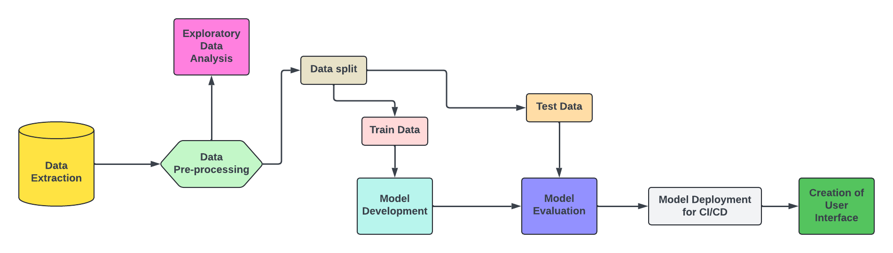
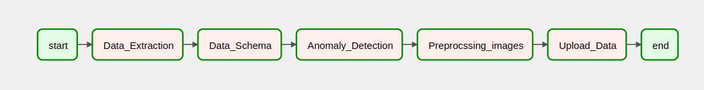
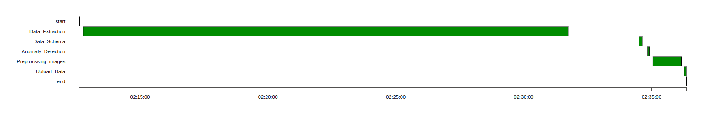

# Multiclass_Disease_Classification
This project is designed to develop, deploy, and maintain a machine learning model for multiclass disease classification of chest X-rays. It utilizes a Machine Learning Operations (MLOps) framework to ensure seamless development, deployment, and continuous monitoring of the model. The project follows best practices for reproducibility, modularity, and scalability.

## Table of Contents
1. [Introduction](#introduction)
2. [Dataset Information](#dataset-information)
3. [Project Workflow](#project-workflow)
4. [Prerequisites](#prerequisites)
5. [Git Repo and Project Structure](#git-repo-and-project-structure)
6. [Data Storage and Model Registry](#data-storage-and-model-registry)
7. [Pipeline](#pipeline)
8. [Application Interface](#application-interface)
9. [Monitoring Dashboard](#monitoring-dashboard)
10. [Contributors](#contributors)
11. [Acknowledgments](#acknowledgments)

## Introduction
Thoracic diseases, such as pneumonia, emphysema, and cardiomegaly, are significant health concerns globally, affecting millions of people each year. In the United States alone, respiratory diseases contribute to a high percentage of hospitalizations and healthcare costs. Accurate diagnosis of these conditions is crucial for effective treatment, yet traditional diagnostic methods rely heavily on manual analysis of medical images like chest X-rays. This process can be time-consuming and subject to human error, especially in areas with limited access to trained radiologists.

Motivated by these challenges, we chose this topic for our MLOps project. By leveraging the principles of MLOps, we have developed an end-to-end machine learning pipeline for automated thoracic disease classification using chest X-rays. Our solution is built to enhance the accuracy and efficiency of non-invasive diagnostic methods, aiming to assist healthcare providers with reliable, timely, and scalable diagnostic support.

By automating the process of classifying multiple thoracic diseases from chest X-ray images, this approach has the potential to alleviate the burden on healthcare professionals, reduce diagnostic errors, and provide faster results, especially in underserved areas where radiologists may not always be available.

This project integrates best practices in MLOps to ensure that our model is not only accurate but also easy to maintain and deploy, making it suitable for real-world clinical use.

## Dataset Information
The project utilizes the NIH ChestX-ray14 dataset, one of the largest publicly available chest X-ray image datasets for research purposes. The dataset is provided by the National Institutes of Health (NIH) Clinical Center and consists of 112,120 frontal-view chest X-ray images from 30,805 unique patients. The dataset is annotated with labels for 14 different thoracic disease categories, including:
### DataCard
- Dataset Name: NIH ChestX-ray14
- Source: National Institutes of Health (NIH) Clinical Center
- Link to Dataset: [NIH Clinical Center ChestX-ray Dataset](https://www.nih.gov/news-events/news-releases/nih-clinical-center-provides-one-largest-publicly-available-chest-x-ray-datasets-scientific-community)
- Domain: Medical Imaging (Radiology)
- Task: Multiclass disease classification from chest X-ray images

### Disease Categories - Labels
1. Atelectasis 
2. Cardiomegaly
3. Effusion
4. Infiltration
5. Mass
6. Nodule
7. Pneumonia
8. Pneumothorax
9. Consolidation
10. Edema
11. Emphysema
12. Fibrosis
13. Pleural Thickening
14. Hernia

## Project Workflow

This is the basic Project Flow and this will be updated after the final system architecture is designed

## Git Repo and Project Structure
**Project Structure**
```
├── .dvc
│   ├── config                # Configuration file for DVC (Data Version Control)
│   ├── .gitignore            # Specifies files/folders related to DVC to be ignored by Git
├── data
│   ├── raw_notebooks              # Directory containing preprocessed training data
│   │   ├── Pre-processing.ipynb   #A Visual example of how the pre-processing steps are executed for a sample data
│   ├── tests
│   │   ├── test_get_data_from_gcp.py #unittest file for getting data from gcp
│   │   ├── test_schema_generation.py #unittest file for generation of schema for the data
│   │   ├── test_anomaly_detection.py #unittest file for detection of anomalies
│   │   ├── test_preprocessing.py #unittest file for testing out the pre-processing steps and augmentation steps
├── assets
│   ├── images  #contains images required for the project
├── config
│   ├── _init_.py
├── Dags
│   ├── Src
│   │   ├── Data  # Kubernetes deployment configuration for the frontend
│   │   |    ├── sampled_data.dvc # resulted.dvc file when folder of sampled_data with image data set is pushed to gcp using DVC
│   │   |    ├── sampled_data_entry.csv.dvc # resulted .dvc file when csv file containg labels and image index is pushed to gcp using DVC
│   │   ├── get_data_from_gcp.py # this file is to execute to get the data from the remote gcp, which is pushed to gcp using DVC
│   │   ├── cloud_data_management.py # this is the file which integrates all the scripts to assist in airflow execution
│   │   ├── schema_generation.py # this file generates the statistics and schema for the data
│   │   ├── anomaly_detection.py # this file uses the schema and other metrics to detect the anomalies
│   │   ├── preprocessing.py # this file executes augmentation to overcome class imbalance and then perform pre-processing steps
├── logs/scheduler
│   ├── model.py              # Defines the model architecture for training
│   ├── train.py              # Script for training the machine learning model
│   ├── evaluate.py           # Script for evaluating the model's performance
│   ├── predict.py            # Script for making predictions using the trained model
│   ├── requirements.txt      # Python dependencies required for the backend
├── .dvcignore                 # Specifies files/folders that should be ignored by DVC
├── .gitignore                 # Specifies files/folders that should be ignored by Git
├── dockerfile                 # Dockerfile to build the Docker image for the main application
├── README.md                  # read me file
├── docker-compose.yaml        # Docker Compose file to set up and run multi-container Docker applications
├── requirements.txt           # Python dependencies required for running the project locally
├── sampled_data.dvc           # resulted.dvc file when folder of sampled_data with image data set is pushed to gcp using DVC
├── sampled_data_entry.csv.dvc # resulted .dvc file when csv file containg labels and image index is pushed to gcp using DVC


```
## Installatioon
This project requires Python version 3.8 or higher. Please ensure that the correct Python version is installed on your device. The project is compatible with Windows, Linux, and macOS operating systems.

#### Pre-requisites
Before you start, please make sure that the following are already installed in your machine, if not please install them.
- Git
- Docker
- Airflow
- DVC
- Python 3
- Pip

###  User Installation:
User should follow the below steps:
1. Clone the repository onto your local machine:
   ```
   git clone https://github.com/SatwikReddySripathi/Multiclass_Disease_Classification.git
   ```
2. Access files: .JSON files which are credentials to GCP Bucket and Drive should be stored in config folder
3. Build Docker Image:
   In Mac:
   ```
   docker compose build
   ```
   In windows:
   ```
   docker-compose build
   ```
4. Run the docker image:
   ```
   docker compose up
   ``` 
5. . To view Airflow dags on the web server, visit https://localhost:8080 and log in with credentials
   ```
   user: airflow
   password: airflow
   ```
6. Run the DAG by clicking on the play button on the right side of the window
7. To stop the docker containers: click ctrl+c in the terminal to kill all the containers

## DVC (Data Version Control):
This is the crucial open source tool to track the changes in the data through out the machine learning pipeline. Thus, allowing us to track the changes in the data over the time making it reproducible and traceable. DVC maintains Git repositories minimal and clutter-free by keeping meta-information apart from data. It's smooth integration with Git makes it possible to handle code, data, and models efficiently. This method guarantees that project states may be readily rebuilt and streamlines collaboration. For machine learning workflows to remain reliable and intact, DVC's emphasis on data versioning is crucial. In this project, the data from the local is uploaded to GCP using DVC. This ensures remote storage of data.

## Google Cloud Computing:
Google Cloud Platform is a suite of cloud computing services offered by Google that provides a series of modular cloud services including computing, data storage, data analytics, and machine learning, alongside a set of management tools. For this project, One must create a service account on google platform services: https://console.cloud.google.com/. One must create a GCP Bucket and store data and models for the efficient performance of the project.

## Integration of Docker and Airflow:
The code essential to execute Airflow is located in the `docker-compose.yaml` file. We can deliver our data pipeline with the necessary dependencies installed by using Docker and containerization. This makes it platform independent, so our data pipeline will work effectively on Windows, Mac, or Linux.

## Data Extraction:
`get_data_from_gcp.py` is the module resposnible for fetching the data from the GCP Bucket and stores the image and metadata. This also includes compression of the images and storage of the image and metadata into pickle file.

## Schema and Statistics Generarion:
This module automates data validation, schema generation, and statistics collection for the data pipeline.In `schema_generation.py`, it uses TensorFlow Data Validation (TFDV), it ensures data integrity, consistency, and quality across training, evaluation, and serving datasets. By defining a standardized schema, this step enables data drift detection, bias assessment, and robust data handling, forming a critical part of our end-to-end machine learning pipeline.

## Anomalies Detection:
The `anomaly_detection.py` script is a utility within this project that performs data validation and anomaly detection. It ensures data consistency by loading and analyzing datasets against a predefined schema using TensorFlow Data Validation (TFDV). The script loads data from a pickle file, applies schema validation, and reports anomalies, aiding in data quality management. This script ensures to check various data issues, including image formats, label correctness, class distribution, and schema conformity, making it an indispensable tool for preprocessing medical imaging data format, and quality.

## Augmentation and Pre-processing:
read me about `preprocessing.py`

## Airflow Dags:
In Airflow, a DAG – or a Directed Acyclic Graph – is a collection of all the tasks you want to run, organized in a way that reflects their relationships and dependencies.A DAG is defined in a Python script, which represents the DAGs structure (tasks and their dependencies) as code. Below is the structure of dag which is being executed:


## Optimized Pipeline:
Airflow DAG Implementation Data Pipeline Gantt Chart. It is a well-liked project management application for tracking and visualizing tasks or activities across time. It offers a visual depiction of a pipeline's timetable, indicating the start and end times of each task. Below is the visualisartion of the DAGs execution



## Data Storage and Model Registry
## Pipeline
## Application Interface
## Monitoring Dashboard
## Contributors
[](https://github.com/SatwikReddySripathi/Multiclass_Disease_Classification/graphs/contributors)

* [@SatwikReddySripathi](https://github.com/SatwikReddySripathi)
* [@DhanushAkula](https://github.com/DhanushAkula)
* [@DhananJayKumarMV](https://github.com/DhananJayKumarMV)
* [@SravyaKodati](https://github.com/SravyaKodati)
* [@vamsijilla](https://github.com/vamsijilla)
* [@malkarsaidheeraj](https://github.com/malkarsaidheeraj)

## Acknowledgments
